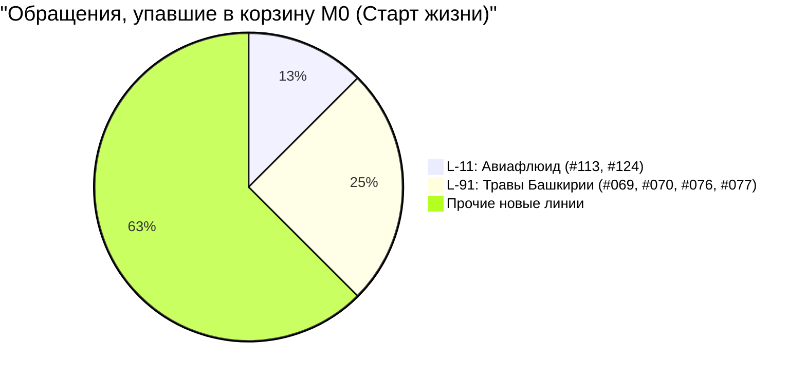
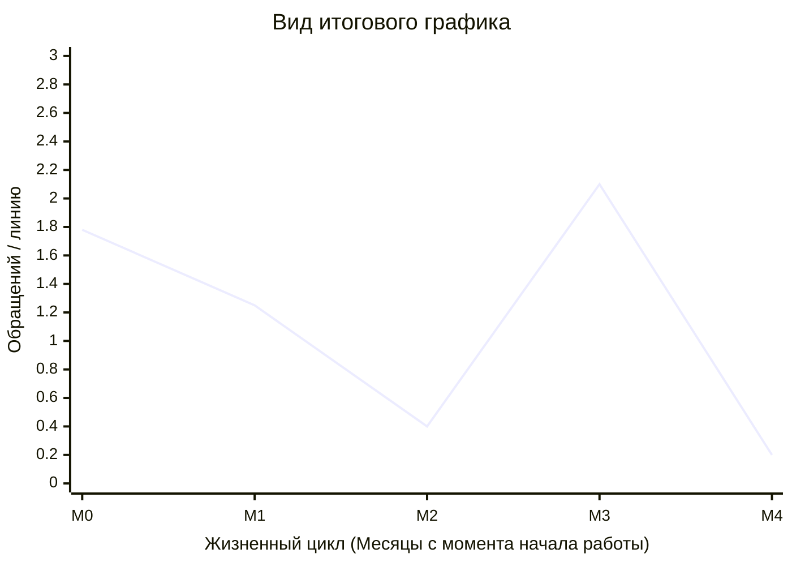

# Визуализация расчета Тренда Обращений (Tickets Trend)

Данный документ описывает процесс того, как сырые обращения из базы данных преобразуются в усредненный показатель для графика **«Тренд обращений»**, где ось X — это относительные месяцы жизни оборудования (M0, M1 ... Mn), а ось Y — среднее количество обращений на линию.

## 1. Общая архитектура вычислений (Поток данных)

```mermaid
flowchart TD
    subgraph Этап 1: Данные из БД
        T[(Таблица: support_tickets)] --> C1(Сбор всех обращений)
        PL[(Таблица: production_lines)] --> C2(Поиск даты старта линии\nstart_date)
    end

    C1 --> M1
    C2 --> M1

    subgraph Этап 2: Нормализация времени
        M1{Вычисление индекса M_i}
        M1 -->|Формула:| F1[Год_обращения - Год_старта * 12\n+ Месяц_обращения - Месяц_старта]
    end

    F1 --> G1

    subgraph Этап 3: Группировка
        G1[Сортировка всех обращений по корзинам M_i]
        G1 -->|Корзина M0| B0([Все тикеты за 1-й месяц])
        G1 -->|Корзина M1| B1([Все тикеты за 2-й месяц])
        G1 -->|Корзина M2| B2([Все тикеты за 3-й месяц])
    end

    B0 --> A1
    B1 --> A2

    subgraph Этап 4: Агрегация (на примере M0)
        A1[Подсчет метрик для M_i]
        A1 --> X[Σ Общее кол-во обращений в M_i]
        A1 --> Y[U Уникальные линии с запросами в M_i]
        
        X --> R((Результат = Σ / U))
        Y --> R
    end

    R --> P[Точка на графике для месяца M_i]
```

---

## 2. Пошаговый разбор на конкретных данных

Представим базу данных, в которой зарегистрированы 2 разные линии оборудования на разных заводах.

### Шаг 1: Определение "Времени Зеро" (`start_date`)

| ID линии | Клиент | Линия | Дата старта в системе (`start_date`) |
|----------|--------|-------|------------------------------------|
| **L-11** | Авиафлюид | Стол агрегации | 25 Марта 2026 |
| **L-91** | Травы Башкирии | Сериализация Н-ПР-02 | 12 Февраля 2026 |

<br/>

### Шаг 2: Расчет относительного индекса (Месяц M_i)
Когда возникают проблемы (тикеты), система сравнивает дату обращения с датой старта конкретной линии:

| Тикет | Линия | Когда сломалось (`reported_at`) | Расчет возраста | Индекс | 
|---|---|---|---|---|
| **#113** | L-11 (Авиафлюид) | **8 Апреля 2026** | Апрель 26 - Март 26 (разница 14 дней) | **M0** |
| **#124** | L-11 (Авиафлюид) | **13 Апреля 2026** | Апрель 26 - Март 26 (разница 19 дней) | **M0** |
| **#201** | L-11 (Авиафлюид) | **5 Июня 2026** | Июнь 26 - Март 26 (2 полных месяца) | **M2** |
| **#069** | L-91 (Травы) | **25 Февраля 2026** | Февраль 26 - Февраль 26 (разница 13 дней) | **M0** |

<br/>

### Шаг 3: Группировка корзин и агрегация



Для **Корзины M0** система выполняет SQL-запрос `COUNT(*)`, находя `Σ = 16 обращений`.
Далее система делает `COUNT(DISTINCT line_id)`, находя `U = 9 уникальных линий`.

**Примечание:** Почему не все линии? Линии, на которых в их первый месяц не было ни одной поломки, фильтром `WHERE t.reported_at IS NOT NULL` не захватываются. Показатель оценивает интенсивность проблем именно среди *сбойного оборудования*.

<br/>

### Шаг 4: Вычисление финальной точки

Остается применить формулу для нахождения среднего показателя обращений.

1. Берем общую сумму из корзины: `16`
2. Делим на количество активных в этой корзине линий: `9`
3. Округляем до сотых: 16 / 9 = 1.7777...

**Итог:** На координате `X = M0` графика появляется точка со значением `Y = 1.78`.


